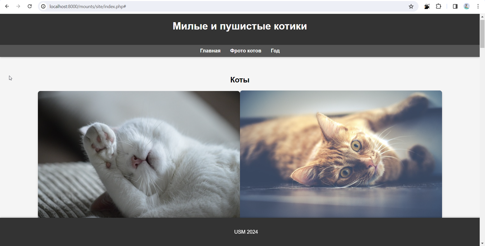

# Лабораторная работа №5  Взаимодействие контейнеров

## Цель работы
Выполнив данную работу студент сможет управлять взаимодействием нескольких контейнеров.

## Задание
Создать php приложение на базе двух контейнеров: nginx, php-fpm.

## Выполнение
Создайте репозиторий `containers05` и скопируйте его себе на компьютер.

В директории `containers05` создайте директорию `mounts/site`. В данную директорию перепишите сайт на php, созданный в рамках предмета по php.

Создайте файл `.gitignore` в корне проекта и добавьте в него строки:
```
# Ignore files and directories
mounts/site/*
```
Создайте в директории `containers05` файл `nginx/default.conf` со следующим содержимым:
```
server {
    listen 80;
    server_name _;
    root /var/www/html;
    index index.php;
    location / {
        try_files $uri $uri/ /index.php?$args;
    }
    location ~ \.php$ {
        fastcgi_pass backend:9000;
        fastcgi_index index.php;
        fastcgi_param SCRIPT_FILENAME $document_root$fastcgi_script_name;
        include fastcgi_params;
    }
}
```
## Запуск и тестирование
Создайте сеть internal для контейнеров.

Создайте контейнер backend со следующими свойствами:

* на базе образа `php:7.4-fpm;`
* к контейнеру примонтирована директория `mounts/site` в `/var/www/html;`
* работает в сети `internal.`

```docker run -d --name backend --network internal -v ${PWD}/mounts/site:/var/www/html php:7.4-fpm```

Создайте контейнер frontend со следующими свойствами:

* на базе образа `nginx:1.23-alpine`;
* с примонтированной директорией `mounts/site` в `/var/www/html`;
* с примонтированным файлом `nginx/default.conf` в `/etc/nginx/conf.d/default.conf`;
* порт 80 контейнера проброшен на порт 80 хоста;
* работает в сети `internal`.

```docker run -d --name frontend --network internal -v ${PWD}/mounts/site:/var/www/html -v ${PWD}/nginx/default.conf:/etc/nginx/conf.d/default.conf -p 80:80 nginx:1.23-alpine```

Проверьте работу сайта в браузере, перейдя по адресу http://localhost. Если отображается базовая страница nginx, то перегрузите страницу.



## Ответьте на вопросы:

* Каким образом в данном примере контейнеры могут взаимодействовать друг с другом?

В данном примере контейнеры могут взаимодействовать друг с другом через созданную сеть internal, используя имена контейнеров в качестве хостов для обращений друг к другу.

* Как видят контейнеры друг друга в рамках сети internal?

Контейнеры в рамках сети internal видят друг друга через их имена контейнеров в качестве хостов. Это означает, что они могут использовать имена других контейнеров для обращения друг к другу внутри этой сети без необходимости использования IP-адресов.

* Почему необходимо было переопределять конфигурацию nginx?


Необходимо было переопределить конфигурацию Nginx, чтобы настроить его таким образом, чтобы обращения к PHP файлам перенаправлялись на контейнер с PHP-FPM, и обеспечить корректную работу веб-сайта в контейнере Nginx.

# Вывод

В результате выполнения лабораторной работы была создана инфраструктура из контейнеров для запуска веб-сайта на PHP. С помощью сети internal контейнеры могут взаимодействовать друг с другом, обращаясь к ним по именам контейнеров. Переопределение конфигурации Nginx было необходимо для правильной маршрутизации запросов к PHP файлам на контейнере с PHP-FPM. Это позволяет эффективно запускать и тестировать веб-приложения в контейнеризованной среде.